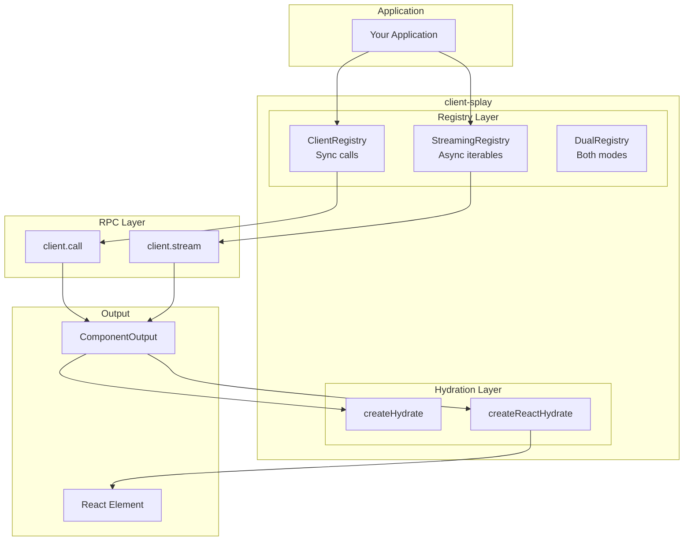
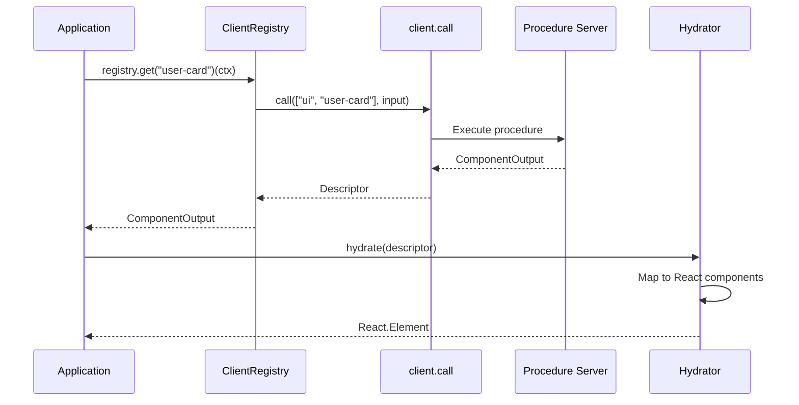
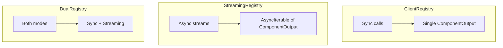
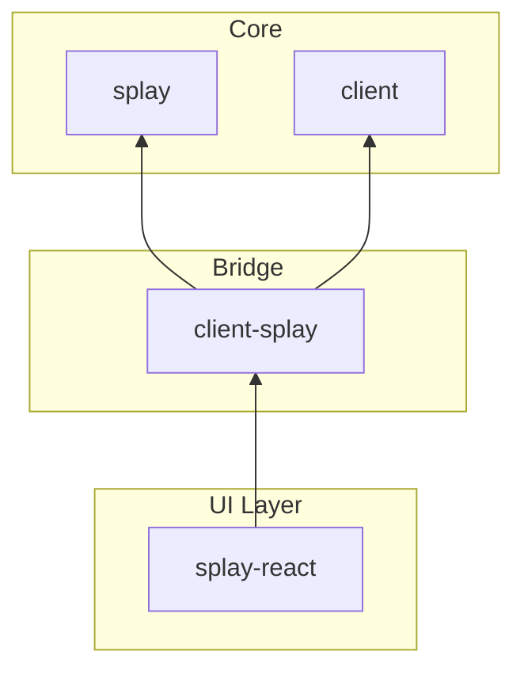

# @mark1russell7/client-splay

[](https://opensource.org/licenses/MIT)
[](https://www.typescriptlang.org/)
[](https://nodejs.org/)

> Bridge between splay's rendering model and client's procedure system. Enables server-side component rendering via RPC.

## Table of Contents

- [Overview](#overview)
- [Installation](#installation)
- [Architecture](#architecture)
- [Quick Start](#quick-start)
- [API Reference](#api-reference)
  - [Registry](#registry)
  - [Hydration](#hydration)
  - [Descriptor Utilities](#descriptor-utilities)
  - [Stream Utilities](#stream-utilities)
- [ComponentOutput Format](#componentoutput-format)
- [Integration](#integration)
- [Requirements](#requirements)
- [License](#license)

---

## Overview

**client-splay** bridges the splay rendering model with the RPC procedure system:

- **Client Registry** - Call component procedures via RPC
- **Streaming Registry** - Handle async component streams
- **Hydration** - Convert descriptors to framework elements (React, etc.)
- **Utilities** - Walk, transform, and validate descriptor trees

---

## Installation

```bash
npm install github:mark1russell7/client-splay#main
```

---

## Architecture

### System Overview



### Component Rendering Flow



### Registry Types



---

## Quick Start

```typescript
import { createClientRegistry, createReactHydrate } from "@mark1russell7/client-splay";
import { call } from "client";

// 1. Create registry backed by client procedures
const registry = createClientRegistry(call, { namespace: "ui" });

// 2. Create hydrator for React
const hydrate = createReactHydrate(React, {
  components: {
    "user-card": UserCard,
    "badge": Badge,
  },
});

// 3. Render a component
const ctx = { data: { userId: 123 }, size: { width: 400, height: 300 } };
const descriptor = await registry.get("user-card")!(ctx);
const element = hydrate(descriptor);
```

---

## API Reference

### Registry

#### ClientRegistry

Sync registry for single-response component calls.

```typescript
const registry = createClientRegistry(call, {
  namespace?: string,  // Procedure path prefix (e.g., "ui")
});

// Usage
const descriptor = await registry.get("user-card")!(ctx);
```

#### StreamingRegistry

Streaming registry for multiple responses over time.

```typescript
const streaming = createStreamingRegistry(stream, {
  namespace?: string,
  bufferSize?: number,  // Default: 16
});

// Usage
for await (const descriptor of streaming.get("live-feed")!(ctx)) {
  render(descriptor);
}
```

#### DualRegistry

Combined registry supporting both sync and streaming.

```typescript
const dual = createDualRegistry(call, stream, isStreaming, options);

// Automatically chooses based on component type
const result = await dual.get("component-name")!(ctx);
```

---

### Hydration

#### createHydrate (Generic)

Framework-agnostic hydration.

```typescript
const hydrate = createHydrate<TComponent>({
  components: ComponentMap,       // Map of type -> component
  fallback?: Component,           // For unknown types
  onNull?: () => TComponent,      // Handle null descriptors
  onFragment?: (children) => TComponent,  // Handle fragments
});
```

#### createReactHydrate

React-specific hydration with createElement integration.

```typescript
const hydrate = createReactHydrate(React, {
  components: {
    "user-card": UserCard,
    "badge": Badge,
    "button": Button,
  },
  fallback?: UnknownComponent,
});

// Usage
const element = hydrate(descriptor);
// Returns: React.Element
```

---

### Descriptor Utilities

```typescript
// Traverse descriptor tree
walkDescriptor(descriptor, (node, path) => {
  console.log(`Node at ${path.join(".")}: ${node.type}`);
});

// Transform nodes
const transformed = transformDescriptor(descriptor, node => ({
  ...node,
  props: { ...node.props, className: "styled" }
}));

// Find matching nodes
const buttons = findInDescriptor(descriptor, n => n.type === "button");

// Get all component types used
const types: Set<string> = getUsedTypes(descriptor);

// Validate against known types
const { valid, unknownTypes } = validateDescriptor(descriptor, knownTypes);

// Serialization
const json = serializeDescriptor(descriptor);
const parsed = parseDescriptor(json);
const compact = compactDescriptor(descriptor); // Remove empty values
```

---

### Stream Utilities

```typescript
// Merge multiple component streams
for await (const output of mergeStreams(stream1, stream2)) {
  render(output);
}

// Rate limiting
for await (const output of throttleStream(stream, 100)) {
  // Max 1 update per 100ms
  render(output);
}

for await (const output of debounceStream(stream, 200)) {
  // Wait 200ms of quiet before emitting
  render(output);
}
```

---

## ComponentOutput Format

The wire format for component descriptors:

```typescript
interface ComponentOutput {
  type: string;                    // Component type or "__null__" / "__fragment__"
  props: Record<string, unknown>;  // Component props
  children?: ComponentOutput[];    // Nested children
  key?: string | number;           // React key
}
```

### Special Types

```mermaid
graph LR
    subgraph "Standard"
        Component["type: 'user-card'"]
    end

    subgraph "Null"
        Null["type: '__null__'<br/>Renders nothing"]
    end

    subgraph "Fragment"
        Fragment["type: '__fragment__'<br/>Wraps children"]
    end
```

### Example Descriptor

```json
{
  "type": "user-card",
  "props": { "userId": 123, "showBadge": true },
  "children": [
    {
      "type": "badge",
      "props": { "label": "Admin" }
    }
  ]
}
```

---

## Integration

### Built-in Procedures

| Path | Description |
|------|-------------|
| `splay.bridge.info` | Package information |
| `splay.bridge.health` | Health check |

### Re-exports from client/components

```typescript
import {
  // Types
  ComponentOutput, FragmentOutput, NullOutput, Size,
  ComponentContext, ComponentFactory, ComponentDefinition,

  // Helpers
  nullOutput, fragment, isFragment, isNullOutput,
  defineComponent, simpleComponent, streamingComponent,
} from "@mark1russell7/client-splay";
```

### Package Hierarchy



---

## Requirements

- **Node.js** >= 20
- **Dependencies:**
  - `@mark1russell7/client`
  - `@mark1russell7/splay`

---

## License

MIT
